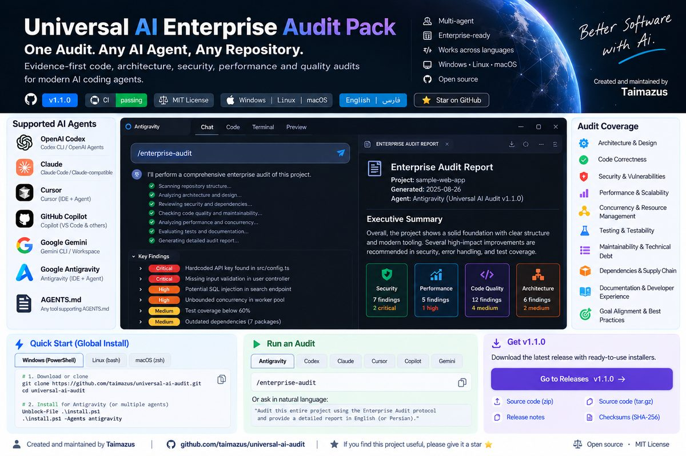

<div dir="rtl">

<p align="center"></p>

# بستهٔ ممیزی و مهارت‌های مهندسی چند agent

نسخه: **1.4.0** · [English](README.md) · [راهنمای کامل فارسی](docs/README.md)

ده skill برای ممیزی جامع، رفع یافته‌ها، امنیت، PR، شکاف تست، آمادگی انتشار، مستندات و حلقهٔ اصلاح، هماهنگ‌کنندهٔ درخواست و Git/Release. گزارش فارسی، شواهد دقیق، بررسی انتخابی و انتقال مشترک یافته‌ها. متن skillها برای قابلیت حمل و کاهش context انگلیسی نگه داشته شده؛ راهنما و مثال همهٔ آن‌ها فارسی موجود است.

## نصب سراسری

ابتدا بسته را [دانلود یا با Git clone کنید](docs/installation.md). همین راهنما دستورهای `git pull` و نصب مجدد برای ارتقا را نیز دارد؛ دستورهای زیر از پوشهٔ دریافت‌شده اجرا می‌شوند.

<div dir="ltr">

```powershell
./install.ps1 -GlobalOnly -Agents all -Skills all -WhatIf
./install.ps1 -GlobalOnly -Agents all -Skills all
```

</div>

<div dir="ltr">

```bash
bash ./install.sh --global-only --agents all --skills all --dry-run
bash ./install.sh --global-only --agents all --skills all
```

</div>

پشتیبانی native: Codex، Claude Code، Cursor، Antigravity، Gemini CLI، GitHub Copilot ، OpenCode، Windsurf/Cascade، Cline و Roo Code؛ generic برای قرارداد مشترک. نصب حساب کاربری محلی خودبه‌خود به session ابری منتقل نمی‌شود.

## راهنماها

- [نصب پروژه‌ای، ارتقا و بازیابی](docs/installation.md)
- [نصب سراسری، جدول مسیرها و منابع رسمی](docs/global-installation.md)
- [مثال کامل همهٔ skillها](docs/skills.md)
- [ترکیب‌های کامل و الگوی ترکیب دلخواه](docs/combinations.md)
- [تست و نگهداری](docs/maintenance.md)
- [مشارکت](CONTRIBUTING.fa.md)
- [امنیت](SECURITY.fa.md)
- [توضیح فارسی مجوز](LICENSE.fa.md) و [مجوز حقوقی اصلی](LICENSE)
- [تاریخچهٔ تغییرات](CHANGELOG.fa.md)

## استفاده

پس از نصب، [راهنمای بررسی خروجی و پاک‌سازی](docs/post-installation.md) توضیح می‌دهد کدام فایل‌ها موقت‌اند، کدام مسیرها باید حفظ شوند و چگونه وضعیت GitHub CLI را بررسی کنید.

```text
security-audit → audit-fix-loop → project-docs → release-readiness را روی این پروژه اجرا کن.
نقص‌های تأییدشده را اصلاح و تست کن، مستندات را هماهنگ کن و یک گزارش فارسی بده.
در صورت blocker نتیجهٔ ناتمام را صریح بگو. انتشار یا deployment انجام نده.
```

فایل‌های موجود بدون Force حفظ می‌شوند و جایگزینی backup یکتا می‌سازد. نصب تازهٔ global همهٔ متن‌ها را به دستورالعمل همیشه‌فعال تزریق نمی‌کند. کپی‌ها و بلوک‌های نسخهٔ قدیمی به صورت خودکار حذف نمی‌شوند؛ راهنمای مهاجرت را بخوانید.

دستورالعمل کوتاه‌تر تضمین بهترین پاسخ یا نبود تمام باگ‌ها نیست. گزارش agent و خط‌مشی سازمانی را بررسی کنید. تست‌ها رفتار installer را می‌سنجند؛ discovery واقعی محصول باید در محیط هدف تأیید شود.

[GitHub](https://github.com/taimazus/universal-ai-audit) · [CI](https://github.com/taimazus/universal-ai-audit/actions) · [Release](https://github.com/taimazus/universal-ai-audit/releases)

</div>
