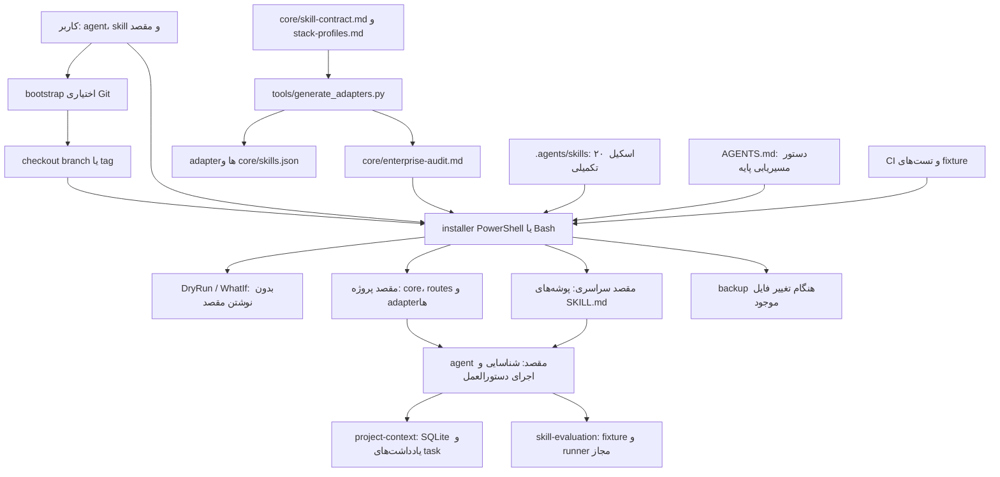
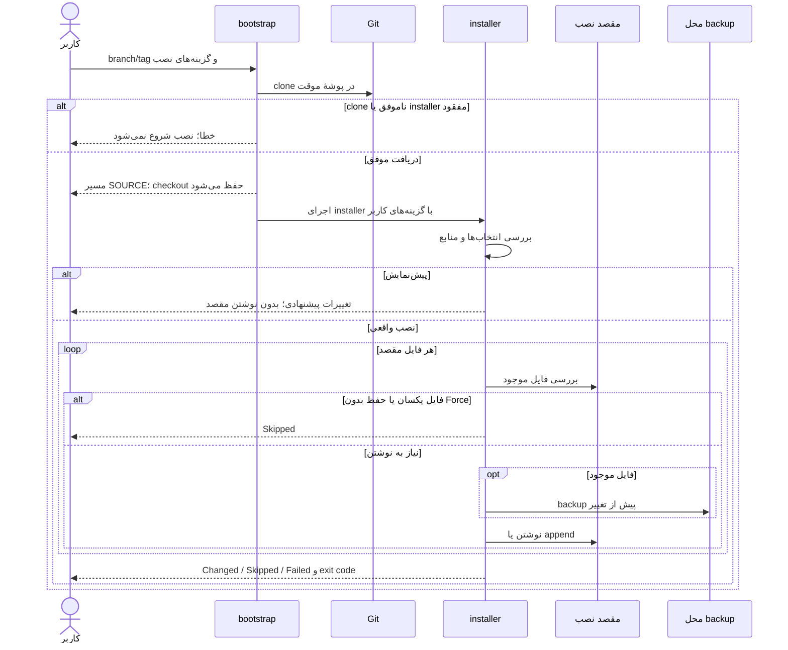
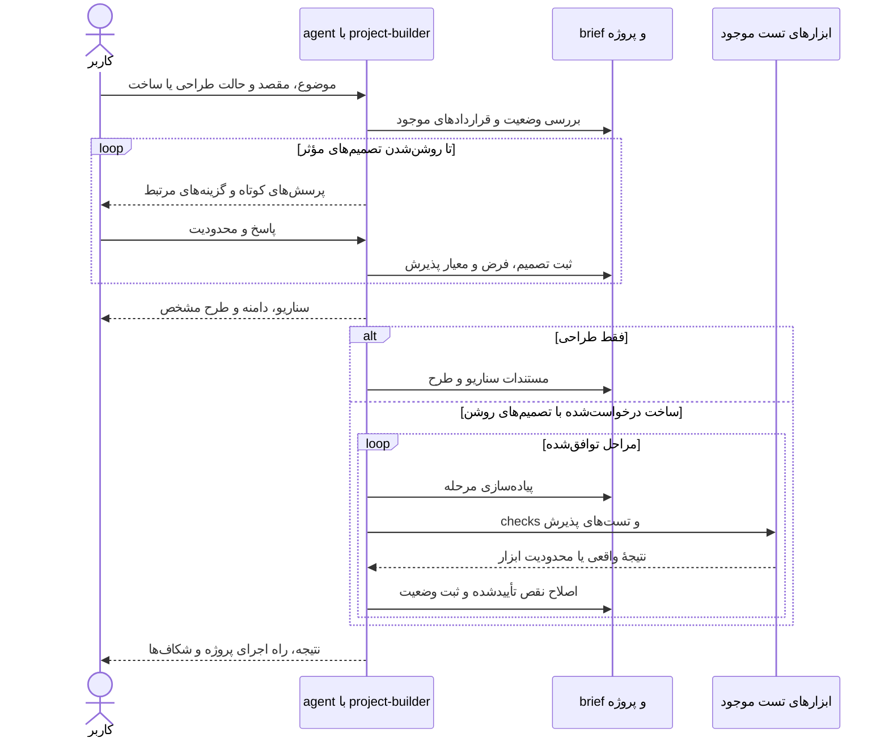

# معماری و جریان‌های اجرا

این repository یک بستهٔ دستورالعمل و installer است؛ سرور یا API سرویس ندارد؛ ابزار حافظهٔ محلی SQLite و ابزار ارزیابی fixture به آن افزوده شده‌اند. نسخهٔ ثبت‌شده در [VERSION](../VERSION)، `1.5.0` است و اسکیل `project-builder` را دارد. فهرست فعلی بیست‌ویک اسکیل را در [راهنمای استفاده](skills.md) ببینید؛ tag قدیمی `v1.4.0` این تغییرات را ندارد و ثبت نسخه به معنی ایجاد Release نیست.

## اجزا و منبع حقیقت

| جزء | مسئولیت و شواهد کد |
| --- | --- |
| پروتکل پایه | [core/enterprise-audit.md](../core/enterprise-audit.md)، خروجی تولیدشده از مهارت enterprise-audit و خوانده‌شده توسط هر دو installer |
| اسکیل‌های تکمیلی | `.agents/skills/<name>/SKILL.md`؛ منبع محتوای تخصصی و منابع اجرایی؛ انتخاب و خواندن توسط هر دو installer |
| دستورالعمل‌های agent | [AGENTS.md](../AGENTS.md)، [CLAUDE.md](../CLAUDE.md) و [GEMINI.md](../GEMINI.md)؛ مسیریابی به پروتکل، نه موتور اجرای خودکار |
| installerهای محلی | [install.ps1](../install.ps1) و [install.sh](../install.sh)؛ نصب پروژه‌ای، سراسری یا هر دو، انتخاب agent/skill، dry-run و backup |
| bootstrapهای Git | [install-from-git.ps1](../install-from-git.ps1) و [install-from-git.sh](../install-from-git.sh)؛ clone branch/tag، اجرای installer و نگه‌داشتن checkout |
| adapterها | مسیرهای native، قواعد Cursor و دستورالعمل Copilot؛ جدول دقیق در [نصب سراسری](global-installation.md) |
| تست و CI | [tests/install.ps1](../tests/install.ps1)، [tests/install.sh](../tests/install.sh) و [ci.yml](../.github/workflows/ci.yml)؛ fixtureهای ایزوله و بررسی installerها |

## نمودار معماری قابل ویرایش

منبع نمودار، بلوک Mermaid همین صفحه است؛ فایل تصویر مستقلی منبع حقیقت نیست.

`enterprise-audit` از پروتکل پایه ساخته می‌شود؛ ۲۰ اسکیل دیگر از منابع تکمیلی خوانده می‌شوند. انتخاب `none` فقط اسکیل‌های تکمیلی را کنار می‌گذارد. installerها منابع را پیش از نوشتن مقصد بررسی می‌کنند؛ یک اسکیل به‌تنهایی وجود همهٔ اسکیل‌های اختیاری را تضمین نمی‌کند.

## sequence نصب مستقیم از Git

ترتیب clone و اجرا از `install-from-git.ps1:20` تا 27 و `install-from-git.sh:23` تا 27 گرفته شده است. DryRun bootstrap نیز checkout را دریافت می‌کند. خطای ورودی یا منابع installer می‌تواند پیش از چاپ خلاصه، اجرا را متوقف کند. خطاهای نوشتن در installer ثبت می‌شوند؛ نصب چندفایلی تراکنش واحد نیست.

## sequence ساخت پروژه با تعامل

این نمودار دستورالعمل اسکیل است، نه یک سرویس یا ابزار خودکار پیاده‌سازی‌شده. منبع: [.agents/skills/project-builder/SKILL.md](../.agents/skills/project-builder/SKILL.md).

## مرزهای قابلیت اطمینان و تغییر

نصب محلی به معنی discovery موفق در همهٔ نسخه‌های agentها نیست. اسکیل‌ها رفتار agent را هدایت می‌کنند و تضمین خروجی بی‌نقص نمی‌دهند. installerها فایل‌ها را مستقیم می‌نویسند و rollback خودکار کل نصب ندارند؛ ریسک قطع پردازش و پوشش‌نداشتن integration bootstrap در [گزارش ممیزی](audit-report.md) ثبت شده است.

PowerShell backupهای جدید را با نام کوتاه و فایل `.path` نگه می‌دارد و برای ریشهٔ بلند fallback به Temp دارد؛ Bash backup را کنار فایل نگه می‌دارد. دستورها و بازیابی در [راهنمای نصب](installation.md) و پاک‌سازی در [راهنمای پس از نصب](post-installation.md) مرجع اصلی‌اند.

## build و render مستندات

در repository، package یا تنظیمات MkDocs/Sphinx/Docusaurus، دستور build مستندات و ابزار render همراه بسته وجود ندارد. CI فعلی Markdown یا Mermaid را build/render نمی‌کند. نمودارهای Mermaid را در preview سازگار نمایش دهید و منبع همین صفحه را ویرایش کنید. در این به‌روزرسانی `mmdc` و `markdownlint` در PATH موجود نبودند؛ export تصویر و بررسی بصری انجام نشد. وجود Node/npm به‌تنهایی renderer محسوب نمی‌شود.

لینک‌ها، anchorهای محلی، fenceها و تطبیق نمودارها با جریان کد بررسی می‌شوند؛ این بررسی جای parser و render واقعی Mermaid را نمی‌گیرد. افزودن ابزار و export در آینده باید نسخه و روش اجرای قابل بازتولید داشته باشد.

